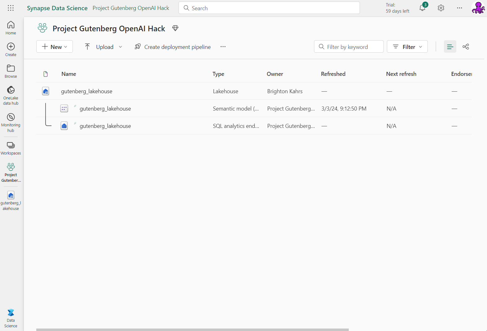

# Objective
This project is created to explore how Microsoft Fabric and Azure OpenAI can be used to analyze a document repository of text-based data. Microsoft Fabric offers the OneLake which means any type of data, including unstructured text, can be stored. Azure OpenAI's intelligence, mixed with clever prompting, can unlock information from text with incredible efficiency. The powerful combination of these two can unlock valuable insights in your text data like never before. You will even be able to use notebooks and Power BI to analyze the enriched document repository! Our text-based document store for this walkthrough will be public domain eBooks.

This project explores the following capabilities of Azure OpenAI, using Microsoft Fabric.
1. Entity Extraction
2. Text Summarization
3. Text Classification
4. Text Embeddings and Semantic Similarity

*[Here](https://www.youtube.com/watch?v=zfkZxRUkEn8) is a link to the video submission - this project should take about 1 hour to complete, follow the project steps below to get started*

*Note: This project leverages data from Project Gutenberg, the first free provider of public domain eBooks. Please consider donating at https://www.gutenberg.org/donate/*

# Real World Value
Many organizations have a treasure trove of text based data. Organization's document stores can be massive and searching through them manually can be time intensive. Tools used in this project make understanding your data and how it connects extremely efficient. Entity extraction can save tons of time sifting through documents for metadata, text summarization can allow you to understand a document much quicker, and text classification can get you started looking in the right direction. Microsoft, in partnership with OpenAI, is leading the way into the new age of artificial intelligence.

For example, a lawyer can use such tooling to find previous court cases that are similar to the one they are working on.

# Prerequisites
1. An [Azure](https://azure.microsoft.com/en-us/free/) subscription
2. Contributor access to a [Microsoft Fabric workspace](https://learn.microsoft.com/en-us/fabric/get-started/workspaces)
3. Access to a [Microsoft Fabric F64 capacity](https://learn.microsoft.com/en-us/fabric/enterprise/buy-subscription) or higher (The Fabric trial FT1 sku will not work for direct Azure OpenAI integration). This capacity should be connected to your workspace.

*Note: an alternative approach would be to leverage any size Microsoft Fabric sku and a provisioned [Azure OpenAI Service](https://learn.microsoft.com/en-us/azure/ai-services/openai/how-to/create-resource?pivots=web-portal)*

# Architecture

# Steps

1. Build Lakehouse

    Go to (or create) the Fabric workspace that will be used for this project, select the 'Data Science' or 'Data Engineering' experience, and create your Lakehouse. Feel free to name it whatever you like!

    

    Then go back to the workspace. The result should look something like this:

    

2. Ingest eBook Data onto OneLake

    Download or clone this repo to access the Jupyter Notebooks in the scripts folder, then import the [01_data_ingestion_and_prep](./scripts/01_data_ingestion_and_prep.ipynb) notebook into your Fabric workspace

    

    *If you do not see the Import Notebook option, make sure you are on the Data Science or Data Engineering experience*
    
    Open notebook item then click Add Lakehouse. Select 'Existing Lakehouse' then choose the Lakehouse you just created. This will make your Lakehouse the default for this notebook

    

    Run each cell in the notebook and follow along with the markdown. Notice how quickly the spark pool starts! You are given some options to change some parameters but the recommend parameters are already set. This notebook will create the necessary folders, ingest the data from Project Gutenberg, and then prepare the data for use with Azure OpenAI by using [Semantic Kernel](https://learn.microsoft.com/en-us/semantic-kernel/), more specifically [text chunker](https://github.com/microsoft/semantic-kernel/blob/main/python/semantic_kernel/text/text_chunker.py)

    After running the script, if you go back to the workspace and open up your Lakehouse, it should look like the following (if it doesnt try hitting the refresh in the top left)

    

     You can explore the data using the Lakehouse explorer

    

3. Enrich eBook Data using Azure OpenAI

    Import the [02_enrich_data_with_AzureOpenAI](./scripts/02_enrich_data_with_AzureOpenAI.ipynb) notebook using the same process as before (including setting the default Lakehouse)

    This notebook will be accessing Azure OpenAI resource from directly within Microsoft Fabric. When using an F64 sku or higher notice how you do not need an API key or a provisioned service in Azure! The use of Azure OpenAI is charged against the capacity units on your F64 capacity. AMAZING! With this lightweight, yet extremely powerful, use of Azure OpenAI we will perform the following:

    1. Entity Extraction
    2. Text Summarization
    3. Text Classification
    4. Generate Embeddings

    Run each cell in the notebook examining how each function is using Azure OpenAI prompting

    The entire text would be too large to fit into the token window for these models. That is why we are using the chunks we created before, and will use a text reduction technique. We summarize each of the smaller chunks, then take all of our summaries to make a summary of the entire document.

    We then use the summary as the input for our classification prompt using the predefined categories in the script

    We use a similar technique to the summarization as we do with embeddings. Embeddings are numeric representations of the semantic meaning of text. Here we get the embedding of each chunk, then take the average of all the embeddings. So more simply we are aiming for the average meaning of the entire text. There are more advanced techniques to weight chunks, but here we use an evenly distributed weight amongst chunks

    All enriched data is saved back to JSON for future use. Data is also saved as a Lakehouse table to be analyzed with notebooks, SQL, and Power BI! Your Lakehouse should now look something like:

    

4. Analyze Enriched Data using Notebooks and Power BI

    Import the [03_TSNE_data_analysis](./scripts/03_TSNE_data_analysis.ipynb) notebook using the same process as step 2 (including setting the default Lakehouse)

    Run the notebook. This notebook will use the embeddings we generated to find 'how' semantically similar each book is based on their cosine similarity. OpenAI ada-002 embeddings have 1536 dimensions which is far too many for humans to visualize. Thus, [TSNE](https://towardsdatascience.com/t-sne-clearly-explained-d84c537f53a) gives us a good and human-friendly estimate of 'how' similar these embeddings are. Here is an example from my most recent run:

    

    Already we can see some clumpings of data from these books! This notebook now saves the x and y axis from this visual, then updates the books table with it. This way we can further our analysis with Power BI, which is our next step!

    Go to the Lakehouse, then open up the SQL analytics endpoint

    

    Here you can do a variety of analytics. You can write SQL queries, generate visual queries, manage the default semantic data model, and create a new report. The report we will create comes from the default semantic data model of the Lakehouse. It leverages Direct Lake mode which means there are no extra steps we need to do to start using Power BI on top of data lake!

    Click new report

    

    This will open up a report connected to the books data we just created

    

    Here is the report I created but feel free to get creative and make your own! To understand how many books were assigned to each category I made a clustered column chart with 'category' on the x-axis and 'Count of book_id' on the y-axis (by clicking the arrow next to book_id in the y-axis you can change the aggregation metric). On the right I made a scatter chart with 'book_id' in the values, 'Sum of x_axis' in the x-axis and 'Sum of y_axis' in the y-axis and 'category' in the legend (I also added zoom sliders from the formatting pane). Then on the bottom I provided the book details in a table visual.

    

    Click 'File' in the top left and save the Power BI report to your workspace, name it whatever you like. Now its time to start using it! Power BI is very interactive, by clicking on any visual it will cross filter others. 

    

    In the scatter chart you can box highlight any of the groupings to see what OpenAI thought were similar texts. 

    

    In a single Power BI report we can see all of the work we did with Azure OpenAI. Entity extraction gives us valuable metadata such as book title, author, and more. Text summarization shows us the summary in the book details. Text classification is shown in our category bar chart. Semantic similarity is shown through the TSNE visualization. Through this we have turned unstructured text data into meaningful insights! 
    
    This concludes the project, thank you for your time. I hope you are now as excited about Microsoft Fabric and Azure OpenAI as I am!

    developer: Brighton Kahrs | brightonkahrs@msn.com
