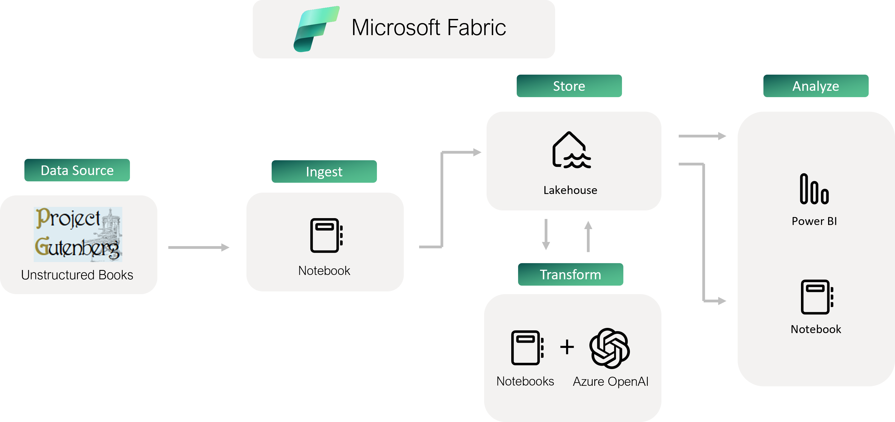

# Objective
This project is created to explore how Microsoft Fabric and Azure OpenAI can be used to analyze textual data. This project goal is to only leverage Fabric + AOAI to see how powerful using only these two architectural components can be for text based analysis. Microsoft Fabric offers the OneLake which means any type of data, including unstructured text, can be stored. The powerful combination of Microsoft Fabric and Azure OpenAI can unlock valuable insights in your text data like never before! In this project you will even be able to analyze text data with Power BI!

This project explores the following capabilities of Azure OpenAI, using Microsoft Fabric.
1. Entity Extraction
2. Text Summarization
3. Text Classification
4. Text Embeddings and Semantic Similarity

*Note: This project leverages data from Project Gutenberg, the first provider of free eBooks. Please consider donating at https://www.gutenberg.org/donate/*

*This project should take about 1 hour to complete, follow the project steps below to get started*

# Prerequisites
1. An [Azure](https://azure.microsoft.com/en-us/free/) subscription
2. Contributor access to a [Microsoft Fabric workspace](https://learn.microsoft.com/en-us/fabric/get-started/workspaces)
3. Access to a [Microsoft Fabric F64 capacity](https://learn.microsoft.com/en-us/fabric/enterprise/buy-subscription) or higher (The Fabric trial FT1 sku will not work). This capacity should be connected to your workspace.

*Note: an alternative approach is to leverage [Azure OpenAI Service](https://learn.microsoft.com/en-us/azure/ai-services/openai/how-to/create-resource?pivots=web-portal)*

# Architecture

# Steps

1. Build Lakehouse

    Go to your workspace, select the 'Data Science' or 'Data Engineering' experience, and create your Lakehouse. Feel free to name it whatever you like!

    

2. Ingest eBook Data onto OneLake

    Download or clone this repo to access the Jupyter Notebooks in the scripts folder, then import the 01_data_ingestion_and_prep notebook into your Fabric workspace

    

    *If you do not see the Import Notebook option, make sure you are on the Data Science or Data Engineering experience*
    
    Open notebook and set the Lakehouse you just created as the default Lakehouse for your notebook

    

    Run each cell in the notebook and follow along with the markdown. You are given some options to change some parameters but the recommend parameters are already set. This notebook will create the necessary folders, ingest the data from Project Gutenberg, and then prepare the data for use with Azure OpenAI by using [Semantic Kernel](https://learn.microsoft.com/en-us/semantic-kernel/), more specifically [text chunker](https://github.com/microsoft/semantic-kernel/blob/main/python/semantic_kernel/text/text_chunker.py)

    After running the script, if you go back to the workspace and open up your Lakehouse, it should look like the following (if it doesnt try hitting the refresh in the top left)

    

     You can explore the data using the Lakehouse explorer

    

3. Enrich eBook Data using Azure OpenAI

    Import the 02_enrich_data_with_AzureOpenAI notebook using the same process as before (including setting the default Lakehouse)

    This notebook will be accessing Azure OpenAI resource from directly within Microsoft Fabric. When using an F64 sku or higher notice how you do not need an API key or a provisioned service in Azure! The use of Azure OpenAI is charged against the capacity units on your F64 capacity. AMAZING! With this lightweight, yet extremely powerful, use of Azure OpenAI we will perform the following:

    1. Entity Extraction
    2. Text Summarization
    3. Text Classification
    4. Generate Embeddings

    Then all enriched data is saved back to JSON for future use. Data is also saved as a Lakehouse table to be analyzed with notebooks, SQL, and Power BI! Your Lakehouse should now look something like:

    

4. Analyze Enriched Data using Notebooks and Power BI

    Import the 03_TSNE_data_analysis notebook using the same process as step 2 (including setting the default Lakehouse). Run the notebook.

    This notebook will use the embeddings we generated to find 'how' semantically similar each book is based on their cosine similarity. OpenAI ada-002 embeddings have 1536 dimensions which is far too many for humans to visualize. Thus, [TSNE](https://towardsdatascience.com/t-sne-clearly-explained-d84c537f53a) gives us a good and human-friendly estimate of 'how' similar these embeddings are. Here is an example from my most recent run:

    

    Already we can see some clumpings of data from these books! This notebook now saves the x and y axis from this visual, then updates the books table with it. This way we can further our analysis with Power BI!

